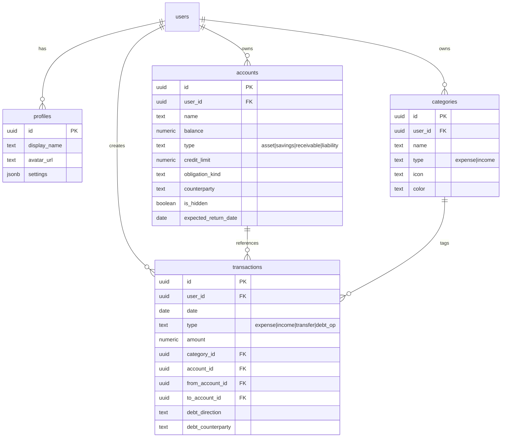
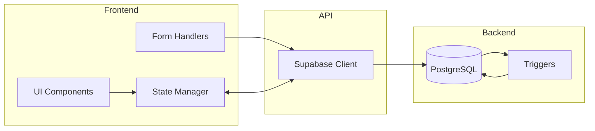

# Ghost Budget — Architecture Documentation

> **Version:** 2.0.0  
> **Last Updated:** 2026-01-15  
> **Status:** Production

---

## 1. Project Overview

Personal budget tracker with Supabase backend, PWA support, and modular JavaScript architecture.

### Tech Stack

| Layer | Technology |
|-------|------------|
| Frontend | Vanilla JS (ES Modules) |
| Backend | Supabase (PostgreSQL + Auth) |
| Hosting | Static files (`npx serve`) |
| PWA | Service Worker + Manifest |

### Dependencies

```json
{
  "name": "ghost-budget",
  "version": "2.0.0",
  "dependencies": "NONE (CDN: Supabase JS)"
}
```

---

## 2. Database Schema

### Tables (4)



### Account Types

| Type | Purpose | Balance | Example |
|------|---------|---------|---------|
| `asset` | Real money | + | Kaspi Gold, Cash |
| `savings` | Goals | + | "На ремонт" |
| `receivable` | Мне должны | + | Друзья-должники |
| `liability` | Я должен | − | Кредиты |

### Key Constraints

| Constraint | Rule |
|------------|------|
| `accounts_type_check` | type IN (asset, savings, receivable, liability) |
| `accounts_credit_card_type_check` | ⚠️ credit_card → type = liability |
| `accounts_obligation_type_check` | obligation_kind → type IN (receivable, liability) |
| `accounts_liability_balance_check` | liability → balance ≤ 0 |

### Functions & Triggers

| Name | Type | Purpose |
|------|------|---------|
| `update_account_balance` | Trigger | Auto-update balances on INSERT/DELETE |
| `update_account_status` | Trigger | Auto-update account status |
| `get_expense_analytics` | RPC | Server-side expense grouping |
| `get_income_analytics` | RPC | Server-side income grouping |
| `get_period_summary` | RPC | Totals for period |
| `get_credit_breakdown` | RPC | Credit card debt calculation |

---

## 3. Frontend Architecture

### File Structure

```
public/
├── index.html          # Single page app
├── style.css           # All styles (1450 lines)
├── manifest.json       # PWA manifest
├── sw.js               # Service Worker
└── js/
    ├── main.js         # Entry point, auth flow
    ├── state.js        # Global state management
    ├── utils.js        # Helper functions
    ├── config.js       # Supabase config
    ├── supabase/       # API layer
    │   ├── client.js
    │   ├── auth.js
    │   ├── accounts.js
    │   ├── transactions.js
    │   ├── categories.js
    │   ├── debts.js
    │   └── index.js    # Re-exports
    └── ui/             # UI components
        ├── components.js
        ├── forms.js        # Re-exports (barrel)
        ├── forms/          # Form modules
        │   ├── transaction-form.js
        │   ├── debt-form.js
        │   └── account-form.js
        ├── modals.js
        └── index.js
```

### Module Responsibilities

| Module | LOC | Purpose |
|--------|-----|---------|
| `state.js` | 336 | Centralized state, computed getters |
| `forms/transaction-form.js` | 190 | Transaction CRUD, form state |
| `forms/debt-form.js` | 270 | Debt operations (lend/borrow/collect/repay) |
| `forms/account-form.js` | 280 | Account management |
| `components.js` | 434 | Render functions |
| `debts.js` | 380 | Debt operations API |
| `transactions.js` | 209 | CRUD transactions |
| `accounts.js` | 195 | CRUD accounts |

---

## 4. 🔴 Critical Issues Found

### Issue 1: DB Constraint Conflict

**Problem:** Database requires `type = 'liability'` for credit cards, but JS now creates them as `asset`.

```sql
-- DB Constraint
CHECK ((obligation_kind <> 'credit_card') OR (type = 'liability'))
```

```javascript
// JS Code (forms.js:498)
accountData.type = 'asset';  // ❌ Conflicts with DB!
```

**Impact:** Credit card creation will fail with DB constraint error.

**Fix:** Remove or update DB constraint:
```sql
ALTER TABLE accounts DROP CONSTRAINT accounts_credit_card_type_check;
```

---

### Issue 2: Edit Form Legacy Types

**Location:** index.html:375-379

```html
<select id="modify-account-type">
    <option value="asset">Актив</option>
    <option value="savings">Накопления</option>
    <option value="debt">Долг</option>  <!-- ❌ WRONG -->
</select>
```

**Problem:** 
- `debt` is not a valid type (should be receivable/liability)
- Missing `receivable` and `liability` options
- Credit card (`asset` + `credit_limit`) not handled

**Fix:** Update to match new architecture.

---

### Issue 3: getCreditAccount() Wrong Filter

**Location:** state.js:297

```javascript
return accountsCache.find(a => a.credit_limit && a.type === 'liability');
// Should be: a.credit_limit && a.type === 'asset'
```

---

### Issue 4: Unused DB Columns

| Column | Table | Status |
|--------|-------|--------|
| `my_portion` | accounts | Unused |
| `friend_portion` | accounts | Unused |
| `payment_amount` | accounts | Duplicate of `monthly_payment` |
| `is_interest` | transactions | Unused |

---

## 5. Recommended Cleanup

### Priority 1: DB Constraint Fix (Blocking)

```sql
-- Remove conflicting constraint for credit cards
ALTER TABLE accounts DROP CONSTRAINT IF EXISTS accounts_credit_card_type_check;
ALTER TABLE accounts DROP CONSTRAINT IF EXISTS accounts_credit_limit_requires_card_check;
```

### Priority 2: Edit Form Refactor

Update index.html modify-account-type select:
```html
<select id="modify-account-type" disabled>
    <option value="asset">Актив</option>
    <option value="savings">Накопления</option>
    <option value="receivable">Мне должны</option>
    <option value="liability">Я должен</option>
</select>
<!-- Make type non-editable, show dynamically based on account -->
```

### Priority 3: State.js Fix

```javascript
// Fix getCreditAccount()
return accountsCache.find(a => a.credit_limit && a.type === 'asset');
```

### Priority 4: Remove Unused Columns

```sql
ALTER TABLE accounts 
    DROP COLUMN IF EXISTS my_portion,
    DROP COLUMN IF EXISTS friend_portion,
    DROP COLUMN IF EXISTS payment_amount;
```

---

## 6. Data Flow



---

## 7. Security

| Feature | Status |
|---------|--------|
| Row Level Security | ✅ All tables |
| JWT Auth | ✅ Supabase Auth |
| Input Validation | ⚠️ Client-side only |
| CORS | ✅ Supabase default |

---

## 8. Changelog

| Date | Change |
|------|--------|
| 2026-01-15 | ✅ Fixed DB constraints for credit card as asset |
| 2026-01-15 | ✅ Fixed edit form with correct account types |
| 2026-01-15 | ✅ Fixed getCreditAccount() filter |
| 2026-01-15 | ✅ Removed unused columns from DB |
| 2026-01-15 | ✅ Deleted outdated ТЗ.md and Новая архитектура.md |
| 2026-01-15 | ✨ UI/UX: Replaced account action buttons with clean Dropdown Menu (⋮) |
| 2026-01-15 | ✨ UI/UX: Improved dropdown padding and touch targets |
